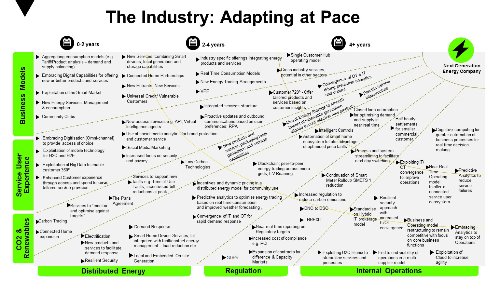

# Energy Industry

The energy industry is the totality of all of the industries involved in the production and sale of energy, including fuel extraction, manufacturing, refining and distribution. Modern society consumes large amounts of fuel, and the energy industry is a crucial part of the infrastructure and maintenance of society in almost all countries.

Energy management is one of the main pillars of Industry 4.0. The motivation comes from a combination of environmental aspects, cost pressure, and regulation as well as the proactiveness of organizations when it comes to efficient consumption of energy and utilities. 

In addition, the integration of different sources of energy generation in an increasingly demanding and distributed market will require management technologies capable of recognizing, predicting and acting in a way to guarantee quality, sustainability, and efficiency, including costs, in energy consumption. 

Modern energy and utilities management systems should be able to exploit a large volume of data collected by various types of meters on a number of variables of interest for a certain industrial operation, assembling the above concepts – extensive monitoring, the Industrial Internet of Things, analyses of large volumes of data, and efficiency and sustainability – around a common, integrated, and robust objective.

Techtalk Energy Industry - by - Irfan Saherwardi

https://web.microsoftstream.com/video/020f50d2-db46-4d25-8e90-abc674e90b44 

Videos from the Global DXC A&E Energy and Utilities Industry Community of Practice

https://web.microsoftstream.com/channel/d5a02296-e455-461c-b32d-fd1b274243d1

## Business Areas

1. [Energy Industry Overview](Overview.md)
2. [Energy Generation](EnergyGeneration.md)
3. [Transmission and Distribution - Smart Grid](SmartGrid.md)
4. [Residential - Smart Home](SmartHome.md)
5. [Innovation in Energy Industry](Innovation.md)
6. [Digital Utility](DigitalUtility.md)

## EA Model

## BVF for Energy Industry

## 5D View of Energy Industry

## Utility Industry and Solutions

## BVF Centrica UseCase

## Centrica Global Energy Supply & Service Line of Business Model

## DXC offering for Utility Industry

## Digital Transformation

## Solving Business Problems

